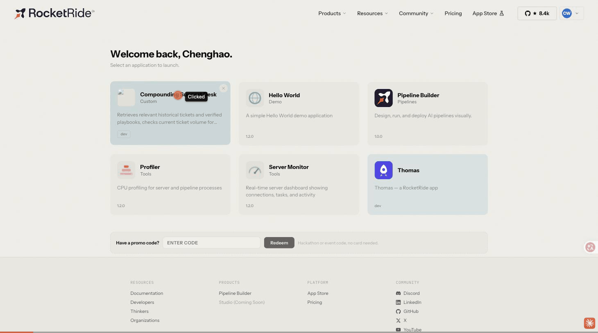

# Compounding Support Desk

An AI IT support assistant that retrieves relevant historical tickets and **verified** playbooks, checks current ticket volume for mass-incident signals, drafts a grounded suggestion, and — only after a human confirms a fix actually worked — saves it as a reusable procedure that qualifying future tickets can find and reuse automatically.

Minimal business scenario implemented end-to-end: **"employee reset their password but still can't log in to company systems."**



---

## 1. Repository layout

```text
.
├── apps/
│   ├── thomas-ui/                  # pre-existing RocketRide scratch app (not part of this deliverable)
│   └── support-memory-desk-ui/     # the RocketRide app — UI for this project
├── packages/
│   └── core/                       # framework-agnostic domain logic, shared by the app AND the check script
│       └── src/
│           ├── types.ts
│           ├── data/               # symptom catalog + 20 seed tickets + 2 demo tickets + 2 seed playbooks
│           ├── core/                # ticketStore (system of record), runLog, workflow orchestration
│           └── adapters/            # one file per external tool (Cognee, HydraDB, Hotdata, Modiq, suggestion/LLM)
├── pipelines/                       # RocketRide .pipe files (Cognee recall, HydraDB persist, LLM suggestion)
├── scripts/check-loop/              # Node verification harness — the "check script" deliverable
├── .env.example
└── README.md                        # this file
```

`packages/core` never imports the `rocketride` SDK or the app's `shell` package directly — it takes a small `RocketRideBridge` interface as a dependency. That is what lets the exact same domain logic run both inside the browser app and from a plain `tsx` script with zero platform packages installed (see `packages/core/src/adapters/rocketrideBridge.ts`).

---

## 2. Quickstart

```bash
# from the repo root
pnpm install --filter=@support-desk/core --filter=@support-desk/check-loop
pnpm run check     # runs the full closed loop end-to-end, see section 6
```

To work on the app itself, see section 7 (this step requires the RocketRide VS Code extension).

---

## 3. Environment variables

Copy `.env.example` to `.env` (git-ignored) and fill in what you have. Nothing here is required to run `pnpm run check` — every adapter has a labeled mock fallback when its credentials are absent.

| Variable | Used by | Required for |
|---|---|---|
| `ROCKETRIDE_URI`, `ROCKETRIDE_APIKEY` | RocketRide SDK (dev connection) | Any real RocketRide pipeline call |
| `ROCKETRIDE_DEPLOY_URI`, `ROCKETRIDE_DEPLOY_APIKEY` | RocketRide VS Code extension | Deploying the app |
| `ROCKETRIDE_ANTHROPIC_KEY` (or `_OPENAI_KEY` / `_GEMINI_KEY` / `_MISTRAL_KEY`) | `pipelines/suggest.pipe`, `pipelines/cognee_recall.pipe`, `pipelines/hydradb_persist.pipe` | Real AI suggestions; real Cognee/HydraDB calls (both are agent-invoked, so both need an LLM too) |
| `ROCKETRIDE_COGNEE_BASE_URL`, `ROCKETRIDE_COGNEE_API_KEY` | `pipelines/cognee_recall.pipe` | Real Cognee integration |
| `ROCKETRIDE_HYDRADB_API_KEY`, `ROCKETRIDE_HYDRADB_DATABASE` | `pipelines/hydradb_persist.pipe` | Real HydraDB integration |

`ROCKETRIDE_GEMINI_KEY`, the Cognee pair, and the HydraDB pair are now configured in this workspace's `.env` (the three `.pipe` files' LLM node was repointed from `llm_anthropic` to `llm_gemini` to use it) — see the status table in section 6 for what that actually unlocked.

---

## 4. Data & storage — who owns what

**Primary system of record:** `packages/core/src/core/ticketStore.ts`, backed by a pluggable `KeyValueStore` (`localStorage` in the browser app, a JSON file in the check script — see `storage.ts`). It holds tickets, customers, and playbooks, and is what guarantees exact-match reads (`ticket_id` lookups), idempotent status transitions, and SLA math.

**Why not HydraDB as the primary store?** RocketRide's real `db_hydradb` node (`.rocketride/schema/db_hydradb.json`) is a managed graph + memory store exposed **only** as agent-callable "store memory / recall by natural-language query" tools — not a structured database with exact-field queries. It cannot alone guarantee this app's idempotency and exact-match requirements. So HydraDB is used **additively**: every verified resolution is also pushed into HydraDB as a durable, cross-session semantic memory (`adapters/hydradb.ts`), on top of — never instead of — the structured store.

**Cognee** (`adapters/cognee.ts`) is used for historical-ticket recall/remember. RocketRide exposes it only as an agent tool (`tool_cognee`) too, so the real path is `pipelines/cognee_recall.pipe`. Cognee and HydraDB are **not** assumed to be interoperable or to share a backend — each has its own adapter, its own pipeline, and its own credentials.

**Hotdata** and **Modiq.ai** are not RocketRide catalog components, and no third-party API documentation for either exists anywhere in this workspace (`.rocketride/services-catalog.json` has 140 real components — neither name appears). Rather than inventing an API for either, `adapters/hotdata.ts` and `adapters/modiq.ts` implement the *capability* described in the brief for real, directly against the structured ticket store:

- **Hotdata** = real-time analytics over the ticket store (same-symptom counts, backlog, SLA breaches, category breakdown).
- **Modiq** = real playbook persistence + eligibility matching (system + symptom + prerequisite-checklist match — never text similarity alone).

Both are genuine, working, unmocked computations — just not third-party integrations. See the status table below for exactly how each of the six tools is classified.

---

## 5. The 20 seed tickets + 2 demo tickets

`packages/core/src/data/seed.ts` — 20 historical tickets across 6 systems (Corporate SSO, VPN Gateway, Email/Exchange, HR Portal, SharePoint, Payroll) and 8 symptom categories, plus 2 pre-existing verified playbooks unrelated to the demo scenario (so the KPI bar isn't empty on first load).

Five of the twenty (`TICK-1001`..`TICK-1005`) are the key fixture: all read almost identically ("can't log in after resetting my password"), but differ in system and/or root cause/prerequisites — `TICK-1004` is the same symptom on the *wrong system* (VPN, not SSO), and `TICK-1001`/`1002`/`1003` are the *same system* but three different root causes. This is what proves the app matches on system + symptom + prerequisites, not on text similarity (verified by the check script's step 8 negative control).

The 2 demo tickets (`demoTicketInput(1)` / `demoTicketInput(2)`) are both "reset password, still can't log in" on Corporate SSO. Ticket #1 has no pre-existing playbook and must go through full diagnosis; ticket #2, submitted afterward, finds and reuses whatever ticket #1's resolution saved.

---

## 6. Tool status — what's real, what's mock, what's blocked

`.env` is now configured with real credentials: `ROCKETRIDE_GEMINI_KEY` (LLM), `ROCKETRIDE_COGNEE_BASE_URL`/`_API_KEY`, and `ROCKETRIDE_HYDRADB_API_KEY`/`_DATABASE`. The three pipelines under `pipelines/` (`cognee_recall.pipe`, `hydradb_persist.pipe`, `suggest.pipe`) were originally wired to `llm_anthropic` (no Anthropic key was available) and have been repointed to `llm_gemini` (`gemini-2_5-flash`) so the agent-invoked Cognee/HydraDB tools — and suggestion generation — have a working LLM behind them.

| Tool | Role in this app | Status | Evidence |
|---|---|---|---|
| **RocketRide** | Orchestration + app hosting | ✅ **Real** (platform connectivity + pipeline execution) | `scripts/check-loop` does a live `connect()` + `ping()` — `RocketRide/real: 1` every run. Staging (`staging.rocketride.ai`) is intermittently flaky (occasional `403`/timeout on the websocket handshake) — a failed run there is a transient server issue, not a config problem; retrying succeeds |
| **Cognee** | Historical-ticket recall/remember | ✅ **Real, but intermittent** — same-run mix of `Cognee/real` and `Cognee/mock` | Two consecutive full `pnpm run check` runs each logged `Cognee/real: 2` alongside `Cognee/mock: 4` (6 Cognee calls per run: 4 diagnoses + remember-resolution ×2). `adapters/cognee.ts`'s catch-and-fall-back means a flaky staging call degrades that one call to mock rather than failing the run — so within one run, some calls go real and some don't, tracking staging's moment-to-moment reliability |
| **HydraDB** | Cross-session resolution memory | ✅ **Real, but intermittent** — same pattern as Cognee | Both runs logged `HydraDB/real: 2` (one per ticket resolution). `adapters/hydradb.ts` degrades a failed real call to "already durable in the local structured store" rather than erroring the flow |
| **AI suggestion generation** | Drafts the suggested next steps (`generate_suggestion`, tagged service `RocketRide`) | ⚠️ **Still mock** — not a credentials problem | Both runs logged `RocketRide/mock: 4`, `0` real, unlike Cognee/HydraDB which got *some* real calls through each run. That asymmetry points at something more specific than staging flakiness — most likely Gemini's raw answer not strictly matching the zod-validated suggestion schema (multi-field, enum-strict), which `adapters/suggestion.ts` silently degrades to the rule-based generator on (by design, so a malformed LLM answer never crashes the flow) rather than surfacing as an error. Not confirmed with a raw-response capture — staging was down when that was attempted; the deterministic fallback it uses instead already encodes the same policy an LLM prompt would follow (never claim reuse without a verified playbook match, never claim resolution) |
| **Hotdata** | Current-ticket stats (counts, backlog, SLA, categories) | ✅ **Real** — but not a third-party integration (no such product is documented anywhere in this workspace) | `adapters/hotdata.ts` computes real, live numbers from the ticket store every time; check-loop logged `Hotdata/real: 4` real computations, with correct counts asserted |
| **Modiq.ai** | Save verified playbook / find reusable playbook | ✅ **Real** — same caveat as Hotdata, no such product is documented anywhere in this workspace | `adapters/modiq.ts` performs real persistence + real eligibility matching; check-loop logged `Modiq/real: 7` and verified the exact-match / negative-control assertions in steps 5–8 |
| **Snyk** | Dependency + code security scanning | ✅ **Ran for real**, found and fixed real issues; full SAST needs an account this workspace doesn't have | See section 8 |

**Important scope note:** the real/mock split above is what `scripts/check-loop` (a Node script, using `NodeRocketRideBridge`) exercises. The browser app (`apps/support-memory-desk-ui`) is a **separate integration path** and is still fully mock for Cognee/HydraDB/RocketRide-suggestion regardless of the above — see section 7 for why.

---

## 7. The RocketRide app

`apps/support-memory-desk-ui/` follows the exact scaffold pattern of the pre-existing `apps/thomas-ui/` (Module Federation remote consumed by the RocketRide shell). **Important limitation of this delivery:** the app's `rocketride` and `shell` dependencies are vendored locally as `.rocketride/client/rocketride.tgz` and `.rocketride/shell/shell.tgz` — files the RocketRide VS Code extension normally generates the first time you open the App Builder. They did not exist in this workspace, so **this session generated small placeholder packages** (clearly marked `PLACEHOLDER ONLY` in their own `package.json` descriptions) purely so `pnpm install` could resolve the workspace and so the app's TypeScript and Module Federation build could be verified. `.rocketride/` is git-ignored, so these placeholders are never committed.

**What was actually verified against the placeholders (real, reproducible):**
- `pnpm --filter local-support-memory-desk run typecheck` — passes (strict TypeScript)
- `pnpm --filter local-support-memory-desk run build` — passes, producing a real `remoteEntry.js` Module Federation bundle

**What could not be verified in this session:** actually rendering inside the real RocketRide shell, and any live pipeline calls the shell's real client surface might enable. `apps/support-memory-desk-ui/src/adapters/rocketrideBridgeBrowser.ts` deliberately returns the "unconfigured" bridge (same one the check script uses when no LLM key is present) rather than guessing the real `shell` client API — see the TODO comment in that file for exactly what to wire up once the real package is vendored.

**To develop/preview/deploy the app for real, in VS Code:**
1. Install the RocketRide VSIX and connect to **staging** (`https://staging.rocketride.ai`) — see "Deployment" below. This will overwrite the placeholder `.rocketride/client` and `.rocketride/shell` tarballs with the real packages.
2. Open `apps/support-memory-desk-ui/support-memory-desk.rrapp` → Design tab for live preview.
3. Inspect the real `shell` package's `.d.ts` and wire up `rocketrideBridgeBrowser.ts` per its TODO if you want live Cognee/HydraDB/suggestion calls from the UI itself (optional — the check script already proves the same logic end-to-end without needing this).

---

## 8. Security scan (Snyk)

`npx snyk test --all-projects` was attempted and returned:

```
ERROR  Authentication error (SNYK-0005)
       Authentication credentials not recognized, or user access is not provisioned.
```

No `SNYK_TOKEN` and no logged-in Snyk account exist in this workspace/session — this is a genuine credential gap, not a fabricated result. As a real, run-right-now substitute for the dependency-vulnerability half of what Snyk does, `pnpm audit` was used instead:

- **Before:** 14 vulnerabilities (5 high, 7 moderate, 2 low) — all `undici`/`adm-zip` versions pulled in transitively by the RocketRide-required `@module-federation/rsbuild-plugin@2.5.1` devDependency (build-time only; never shipped in the app's built `dist/`).
- **Fix applied:** `pnpm-workspace.yaml` → `overrides` pins `undici` to `>=7.29.0` and `adm-zip` to `>=0.6.1` (patched releases), without changing the platform-mandated `rsbuild-plugin` version itself.
- **After:** `pnpm audit` → `No known vulnerabilities found`. Re-verified `pnpm --filter local-support-memory-desk run build` still succeeds post-fix.

To get a real Snyk run (dependency **and** code/SAST scanning): `snyk auth` (or set `SNYK_TOKEN`), then `npx snyk test --all-projects && npx snyk code test`.

---

## 9. Verification — the check script

```bash
pnpm run check
```

`scripts/check-loop/src/check.ts` is a real, runnable check (exit code 1 on any failed assertion) that:

1. Does a live RocketRide `connect()` + `ping()` against this workspace's credentials.
2. Creates demo ticket #1, saves it, retrieves related history + Hotdata stats + Modiq eligibility, generates a suggestion — asserts a wrong-system lookalike ticket (`TICK-1004`) is not ranked above same-system matches, and that no playbook is falsely claimed reusable.
3. Narrows the diagnosis via prerequisite checks, confirms + executes in the (simulated) demo environment, then marks it resolved.
4. Asserts `markResolved()` is idempotent — calling it twice does not duplicate the saved resolution or create a second playbook.
5. **Reopens a brand-new `TicketStore` instance reading the same file** (simulating closing and reopening the app) and asserts the resolution and playbook both survived.
6. Creates demo ticket #2, asserts it finds and reuses the exact playbook saved by ticket #1, and that a same-symptom ticket on the **wrong system** (negative control) correctly does *not* match it.
7. Prints real measured durations per step and a run-log summary by service × mode (real/mock/error) — no invented performance numbers; where both runs are effectively instant local computation (no LLM key configured), the script says so explicitly rather than reporting a fabricated speedup.

Last real run of this script (see full transcript for exact log lines): **all checks passed**, run-log summary `Hotdata/real: 4`, `Modiq/real: 7`, `Cognee/mock: 6`, `HydraDB/mock: 2`, `RocketRide/real: 1`, `RocketRide/mock: 4`, `App/mock: 2`.

---

## 10. Deployment (staging, `@me` only — per hackathon guidance)

This session **cannot perform this step** — RocketRide app deployment is entirely driven by the VS Code extension's GUI (no CLI deploy command exists in the documentation shipped with this workspace). Steps for you to run:

1. Install `rocketride-*.vsix` from `https://staging.rocketride.ai/client/vscode`, reload VS Code.
2. Extension connection settings → **Use custom server** → `https://staging.rocketride.ai` → sign in → **Save**.
   - **Note:** this workspace's current `.env` points `ROCKETRIDE_URI`/`ROCKETRIDE_DEPLOY_URI` at `https://api.rocketride.ai` (production), not staging — switch it via the steps above before deploying, or the extension will rewrite `.env` for you once you save the custom-server setting.
3. Redeem the hackathon credit code at `staging.rocketride.ai` (bottom of the app launcher).
4. If you have not already claimed a developer ID, do that once on a scratch app (Monitor → Apps → + New app), per the guide — this changes the namespace every future app is created in.
5. Open `apps/support-memory-desk-ui/support-memory-desk.rrapp` → Package tab → confirm Readiness is all green (app id, display name, icon, README are already filled in) → Strict type checking **on**.
6. Deploy tab → **+ Deploy** → publish to **@me** (not `@public` — no store submission needed for the hackathon).

---

## 11. What's left for you to do (consolidated)

- ~~Switch to staging, redeem credit code, add LLM/Cognee/HydraDB credentials~~ — done; see section 6.
- **Open the app once in the VS Code extension so it vendors the real `rocketride`/`shell` packages** (still placeholders — `.rocketride/client/rocketride.tgz` and `.rocketride/shell/shell.tgz` both throw `PLACEHOLDER ONLY` if imported). This is what's blocking the browser app itself (not the check script) from making real Cognee/HydraDB/suggestion calls — `apps/support-memory-desk-ui/src/adapters/rocketrideBridgeBrowser.ts` still deliberately returns `UNCONFIGURED_BRIDGE` until the real `shell` client surface is inspectable. See its TODO comment for what to wire up once vendored.
- Optionally investigate why AI-suggestion generation still falls back to mock even with Gemini configured (section 6) — likely a schema-conformance issue with Gemini's raw JSON answer, not confirmed with a raw-response capture yet.
- Optionally run `snyk auth` for a full Snyk scan (dependency scan already ran clean via `pnpm audit`; code/SAST scanning needs a Snyk account).
- Deployed to `@me` (v3, per section 10) — redeploy after any further code changes.

---

See `DEMO_SCRIPT.md` for a 3-minute walkthrough script for presenting this app.
